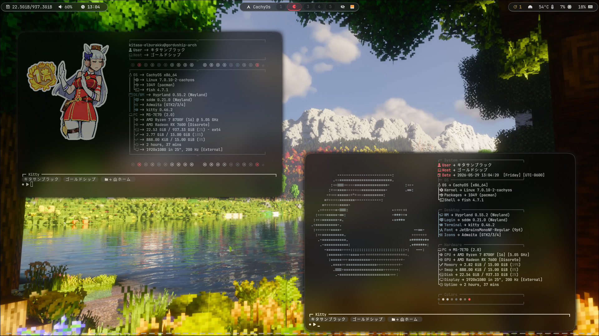
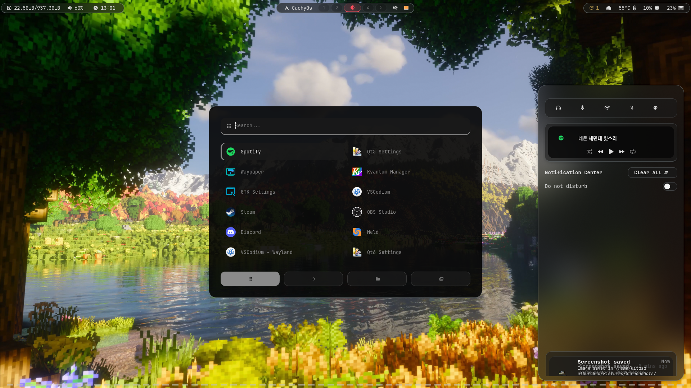
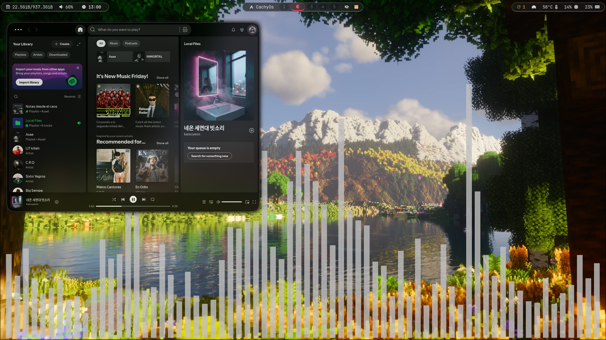
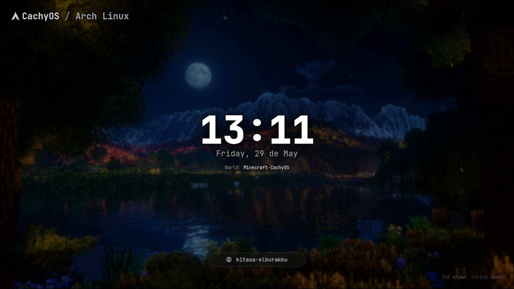

# Minecraft-Rice-Hyprland

Rice personal para Hyprland inspirado en una estetica Minecraft / CachyOS / Arch Linux. Este repositorio guarda mis dotfiles y scripts de escritorio: no es un instalador universal, no promete funcionar en cualquier maquina y esta pensado principalmente como referencia educativa para leer, copiar partes y adaptar.

El setup esta construido sobre CachyOS / Arch Linux, usa Hyprland con configuracion modular en Lua y combina Waybar, Rofi, Kitty, Fish, Starship, Fastfetch, Hyprlock, Hypridle, Wlogout y SwayNC.

## Hardware utilizado

CPU: AMD Ryzen 7 8700F
GPU: AMD Radeon RX 7600 8GB
RAM: 16GB DDR5
Monitor: 1920x1080 @ 200Hz
OS: CachyOS

Esta configuración fue desarrollada y probada principalmente en este hardware.

## Screenshots
## Screenshots

### Desktop



### Waybar



### Terminal-BG



### Hyprlock 



## Features

- Configuracion de Hyprland separada en modulos Lua dentro de `hypr/modules/`.
- Autostart para wallpaper animado con `mpvpaper`, Waybar, SwayNC, Hypridle, Polkit, clipboard y udiskie.
- Waybar con modulos para disco, audio, reloj, workspaces, tray, updates, red, temperatura, CPU y memoria.
- Rofi como launcher de aplicaciones y como selector para historial de clipboard.
- Kitty con Fish como shell, colores personalizados y soporte para imagenes de Fastfetch.
- Fish con Starship, Fastfetch aleatorio, aliases modernos, funciones de actualizacion y limpieza.
- Hyprlock con layout visual, wallpaper, reloj, fecha, usuario, estado de bateria y scripts MPRIS.
- SwayNC con centro de notificaciones, controles rapidos y tema `goldship`.
- Wlogout con acciones de bloqueo, salida, suspension, apagado, hibernacion y reinicio.
- Atajos para screenshots, color picker, control multimedia, scratchpad, Waybar reload y herramientas de sistema.

### Extras

Este rice utiliza terminal-bg, una herramienta creada por DaarcyDev
que permite utilizar contenido animado dentro de la terminal.

- YouTube: https://www.youtube.com/@DaarcyDev
- GitHub: https://github.com/DaarcyDev/terminal-bg

## Estructura del repo

```text
.
├── fastfetch/        # Configs jsonc, logos y presets visuales de fastfetch
├── fish/             # config.fish, funciones y temas de Fish shell
├── hypr/             # Hyprland Lua, modulos, hypridle.conf y hyprlock.conf base
├── hyprlock/         # Layout, colores, wallpaper y scripts de lock screen
├── kitty/            # Configuracion de Kitty y colores
├── rofi/             # Launcher y tema Rofi
├── swaync/           # Config, estilos, iconos y tema de notificaciones
├── waybar/           # Config, CSS y scripts de Waybar
└── wlogout/
├── scripts/          # Scripts personales
│   └── terminal-bg-cava.sh          # Layout, CSS, iconos y scripts de apagado/sesion
```

## Dependencias

Los nombres pueden variar segun repositorios habilitados, CachyOS, AUR o cambios de paquetes. Revisa cada paquete antes de instalarlo.

### Base recomendada para Arch/CachyOS

```bash
sudo pacman -Syu
sudo pacman -S \
  hyprland waybar kitty fish starship fastfetch rofi-wayland \
  hyprlock hypridle swaync wlogout \
  pipewire wireplumber pavucontrol playerctl \
  networkmanager network-manager-applet \
  bluez bluez-utils blueman \
  wl-clipboard cliphist grim slurp swappy \
  thunar btop udiskie polkit-kde-agent \
  jq curl imagemagick libnotify \
  pacman-contrib reflector fzf bat eza zoxide ripgrep \
  lm_sensors ttf-jetbrains-mono-nerd
```

### Dependencias AUR o por verificar

```bash
yay -S \
  mpvpaper \
  hyprshot \
  hyprpicker \
  nwg-look \
  brave-bin \
  vscodium-bin \
  cava \
  glava \
```

Marcadas como **por verificar**:

- `hyprland-lua`: este rice usa `hypr/hyprland.lua` y llamadas `hl.*`, no un `hyprland.conf` clasico. Verifica cual es el paquete/plugin/metodo correcto para tu version de Hyprland.
- `hyprshutdown`: aparece como fallback opcional en un keybind.
- `glava`: usado opcionalmente por scripts de Hyprlock si Spotify esta reproduciendo.
- `Future-black-cursors`, `Colloid-cursors`, SDDM Minecraft, Minegrub, cursores, wallpapers y assets externos: instala o reemplaza segun tu sistema.
- `obs`, `brave`, `vscodium`: son aplicaciones personales atadas a keybinds, no requisitos del entorno base.

## Instalacion manual

Este repo no es plug-and-play. Haz backup de tu configuracion actual antes de copiar nada.

```bash
git clone https://github.com/kitasael-burakku/Minecraft-Rice-Hyprland.git ~/dotfiles
cd ~/dotfiles
```

Copia las carpetas que quieras usar:

```bash
mkdir -p ~/.config
cp -r hypr waybar rofi kitty fish fastfetch hyprlock swaync wlogout scripts ~/.config/
```

Da permisos de ejecucion a los scripts:

```bash
chmod +x ~/.config/waybar/scripts/*.sh
chmod +x ~/.config/rofi/launcher.sh
chmod +x ~/.config/swaync/scripts/*.sh
chmod +x ~/.config/wlogout/scripts/*.sh
chmod +x ~/.config/hyprlock/scripts/*.sh
chmod +x ~/.config/scripts/terminal-bg-cava.sh
```

Si quieres usar Fish como shell:

```bash
chsh -s /usr/bin/fish
```

Antes de iniciar sesion en Hyprland, revisa las rutas, monitores, sensores, wallpaper y programas. Si algo no existe en tu sistema, Hyprland puede iniciar incompleto o algunos atajos no haran nada.

## Hyprland en Lua

La configuracion principal esta en:

```text
hypr/hyprland.lua
```

Ese archivo carga modulos:

```lua
require("modules.animations")
require("modules.autostart")
require("modules.decoration")
require("modules.environment")
require("modules.input")
require("modules.programs")
require("modules.keybinds")
require("modules.layout")
require("modules.misc")
require("modules.monitors")
require("modules.windowrules")
```

Esto no es el formato clasico de `hyprland.conf`. Necesitas tener funcionando el soporte de Lua para Hyprland en tu instalacion. Si tu Hyprland solo lee `hyprland.conf`, esta configuracion no cargara tal cual.

Archivos importantes:

- `hypr/modules/programs.lua`: terminal, file manager y launcher.
- `hypr/modules/keybinds.lua`: atajos de teclado, screenshots, multimedia y sesion.
- `hypr/modules/autostart.lua`: servicios y programas que arrancan con Hyprland.
- `hypr/modules/monitors.lua`: salida, modo, posicion y escala.
- `hypr/modules/input.lua`: layout de teclado y dispositivos especificos.
- `hypr/modules/environment.lua`: variables de entorno Wayland, Qt, Electron y AMD.

## Notas para principiantes

- No copies todo a ciegas. Empieza por una carpeta, prueba, y luego sigue con otra.
- Si un comando falla, ejecutalo manualmente en terminal para ver el error real.
- Las rutas con `/home/tu-usuario/...` son ejemplos. Cambialas por tu usuario o usa `$HOME` cuando el programa lo soporte.
- Los iconos dependen de Nerd Fonts. Si ves cuadros raros, instala y selecciona una Nerd Font.
- Waybar puede romper el modulo de temperatura si tu sensor no es el mismo.
- Las funciones de Fish ejecutan tareas reales como actualizar paquetes y limpiar cache. Leelas antes de usarlas.
- Los scripts de Hyprlock usan MPRIS, `playerctl`, `curl`, `jq`, `imagemagick` y datos externos como `wttr.in` o `ipinfo.io`.
- Algunas configuraciones estan pensadas para mi hardware, mis programas y mi flujo de trabajo.

## Cosas que debes cambiar

Revisa como minimo:

- `hypr/hyprlock.conf`: cambia `$hyprlockDir = home/tu-usuario/.config/hyprlock` por tu ruta real. Probablemente deberia ser algo como `/home/tu-usuario/.config/hyprlock`.
- `hypr/modules/autostart.lua`: cambia el wallpaper animado `~/Videos/wallpapersvideo/minecraft.mp4`.
- `hypr/modules/autostart.lua`: cambia o instala el cursor `Future-black-cursors`.
- `hypr/modules/environment.lua`: revisa `XCURSOR_THEME`, variables AMD y variables Qt segun tu hardware.
- `hypr/modules/input.lua`: cambia nombres de mouse/teclado si no tienes esos dispositivos.
- `hypr/modules/programs.lua`: cambia `kitty`, `thunar` o el launcher si usas otras apps.
- `hypr/modules/keybinds.lua`: cambia `brave`, `obs`, `vscodium`, rutas de screenshots y comandos que no uses.
- `waybar/config.jsonc`: cambia `hwmon-path = /sys/class/hwmon/hwmon3/temp1_input` por el sensor correcto de tu maquina.
- `waybar/config.jsonc`: revisa `pavucontrol`, `nm-connection-editor`, `kitty fish -lc 'sysupdate'` y el script de updates.
- `hyprlock/layouts/layout.conf`: cambia `~/.config/hyprlock/wallpapers/1.png` si usas otro wallpaper.
- `wlogout/style.css`: revisa las rutas `HOME`, `$HOME` y `$HOME.config`; algunas pueden necesitar una ruta absoluta porque CSS no siempre expande variables de shell.
- `fastfetch/config*.jsonc`: cambia logos, imagenes y presets si no quieres usar los assets incluidos.
- `swaync/config.json`: cambia botones como `blueman-manager`, `nwg-look` o `nm-connection-editor` si no los usas.

Para encontrar rutas absolutas o referencias personales:

```bash
rg "/home/|tu-usuario|wallpaper|hwmon|Future-black|Colloid" .
```

## Scripts y comandos detectados

Este rice referencia, entre otros:

- Hyprland/Wayland: `hyprctl`, `hyprlock`, `hypridle`, `waybar`, `swaync`, `swaync-client`, `wlogout`.
- Audio/media: `wpctl`, `pavucontrol`, `playerctl`, `cava`, `glava`.
- Screenshots/clipboard: `hyprshot`, `grim`, `slurp`, `swappy`, `wl-copy`, `wl-paste`, `cliphist`, `hyprpicker`.
- Sistema: `systemctl`, `loginctl`, `pacman`, `yay`, `checkupdates`, `paccache`, `journalctl`, `lm_sensors`.
- Red/GUI: `nm-connection-editor`, `blueman-manager`, `nwg-look`.
- Terminal/shell: `kitty`, `fish`, `starship`, `fastfetch`, `fzf`, `bat`, `eza`, `zoxide`, `ripgrep`.
- Utilidades: `curl`, `jq`, `imagemagick`/`magick`, `libnotify`/`notify-send`, `udiskie`, `reflector`.

## Creditos externos

Este repositorio mezcla configuracion propia con herramientas, temas, assets y referencias de terceros.

- Hyprland, Waybar, Rofi, Kitty, Fish, Starship, Fastfetch, Hyprlock, Hypridle, Wlogout y SwayNC pertenecen a sus respectivos proyectos.
- Minecraft es propiedad de Mojang/Microsoft. La estetica usada aqui es fan-made/personal.
- SDDM Minecraft, Minegrub, cursores, wallpapers, iconos, logos, imagenes y otros assets externos no son mios salvo que se indique explicitamente lo contrario.
- Los logos o imagenes de personajes incluidos en `fastfetch/fastfetchlogo/` y wallpapers deben tratarse como assets externos si no hay una nota clara de autoria propia.
- Nerd Fonts y JetBrains Mono Nerd Font pertenecen a sus respectivos autores/proyectos.

Si reutilizas este rice, conserva los creditos de los proyectos y assets que uses.

## Advertencias

- No hay garantia de compatibilidad con todas las versiones de Hyprland.
- No es un instalador automatico ni una configuracion universal.
- Algunas rutas estan escritas para ser didacticas y deben modificarse.
- Algunos comandos pueden fallar si falta un paquete o servicio.
- Las acciones de Wlogout ejecutan apagado, reinicio, suspension e hibernacion.
- Las funciones de Fish pueden modificar paquetes, cache y archivos de usuario.
- Revisa cualquier script antes de ejecutarlo en tu sistema.
- No se incluye licencia en este README porque no se debe inventar una. Si quieres publicar una licencia, agregala de forma explicita en un archivo `LICENSE`.

## Estado del proyecto

Este repo representa mi rice personal en progreso. Puede tener rutas, decisiones y dependencias muy especificas de mi sistema. Usalo como material de aprendizaje y como base para crear tu propia configuracion, no como una receta cerrada.
