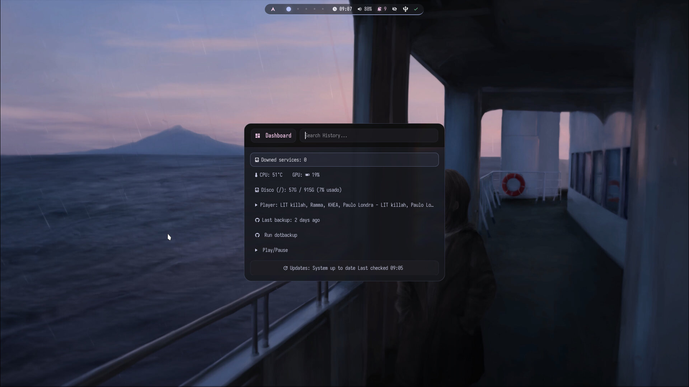

<div align="center">

# ⛏️ Minecraft-Rice-Hyprland

**A personal, heavily-customized Hyprland rice with a Minecraft-inspired look — built for CachyOS, configured in Lua, and meant to be read before it's used.**


</div>

<br>

> ### The Philosophy
> This is **not an automatic installer** and **not a universal configuration** — it does **not** guarantee compatibility with your system. It's built around one idea:
>
> **Read → Understand → Adapt → Learn → Build your own configuration.**
>
> You can do whatever you want with this dotfile. If you don't want to install or use it, you simply don't have to copy it.

> 🎨 **Dynamic theming via matugen — off by default.** The base palette ("Kitasan Glass") is hardcoded and intentional; that's what you get on a fresh clone. Toggle `SUPER + SHIFT + W` and every app derives a Material You palette from your current wallpaper instead. See [docs/THEMING.md](docs/THEMING.md).

> 🖱️ **Infinite Desktop via a Python script**, letting you pan and navigate a boundless canvas of floating windows. Built by **sarodscommits** — full credit in [External Credits](#external-credits).

<br>

## ✨ Repository highlights

- 🎛️ **Session managed by `systemd --user`**, not loose background processes — every daemon (Waybar, SwayNC, Hypridle, clipboard, wallpaper daemon, etc.) is a real unit with `Restart=`, its own journal, and a clean start/stop lifecycle tied to `graphical-session.target`
- ⌨️ **`kitasan` — one CLI for the whole rice**: health checks, cache cleanup, updates, visual theme switching, desktop modes, and a system dashboard, all under one command with Fish completions
- 🩺 **Three read-only checkers behind `kitasan doctor`** — template/static colour parity, cross-file drift (do `gtk.css`'s imports resolve? do the five places that name the icon theme agree? does anything still load what matugen generates?), and `KEYBINDS.txt` vs. `keybinds.lua`. Plus `kitasan doctor --fresh-clone`, which reports which machine-specific values don't yet resolve on *your* box. None of them writes anything
- 🎨 Opt-in Material You theming that regenerates **14 color files** through matugen — including GTK3/GTK4 and Qt5/Qt6, not just the terminal-adjacent apps — across 9 selectable Material You schemes
- 🚀 A handful of purpose-built Rofi tools beyond the launcher — Wi-Fi, Bluetooth, audio device, MPRIS player picker, quick power menu, service manager, visual theme picker, and a system dashboard, all native Rofi script mode
- 🖱️ Custom two-level Rofi wallpaper picker (video / image, each with its own theme) — built from scratch as native Rofi script mode, no external project
- 🌐 Rofi web hub (`SUPER + SHIFT + /`) — category → page launcher over a static, hand-maintained URL list, opens with whatever browser is already configured
- 📊 **Waybar in three islands with cursor-zone reveal** — the centre is permanent, the two side islands stay hidden until the cursor enters their third of the top band, then cascade in. Driven by a resident Python watcher that talks to Hyprland's socket directly and rewrites one CSS file
- 🌀 Hand-tuned custom animation system, "流水 · Ryūsui Motion" (curves & springs), including a GTK3-verified animation layer for the bar itself
- 🪟 **Infinite Desktop** — pan and navigate a boundless floating-window canvas, now itself a supervised systemd service
- 🐟 Custom Fish functions for health checks, maintenance, and an interactive keybind viewer — `KEYBINDS.txt` is generated from `keybinds.lua`, not maintained by hand
- 🪟 **Two external Hyprland plugins**, loaded through `hyprpm` and configured in `hypr/plugins/` — [hyprglass](https://github.com/hyprnux/hyprglass) for the glass material and [hypr-dynamic-cursors](https://github.com/VirtCode/hypr-dynamic-cursors) for cursor motion. Both optional, both guarded so a missing plugin can't take the config down. Full attribution in [docs/PLUGINS.md](docs/PLUGINS.md)
- 🎮 Minecraft-themed boot experience: Qylock (SDDM) + MINEGRUB (GRUB)

<br>

## 🚀 Quick Features

| Feature | Included |
|---|---|
| Lua-based Hyprland configuration | ✅ |
| Session & daemons managed by `systemd --user` | ✅ |
| `kitasan` unified CLI (health / clean / update / theme / mode / dashboard) | ✅ |
| `kitasan doctor` — read-only config checkers, incl. `--fresh-clone` | ✅ |
| Desktop modes — normal / focus / gaming / cinema | ✅ |
| Waybar — three islands, cursor-zone reveal, audio slider, media controls | ✅ |
| Dynamic theming via matugen — Rofi, Waybar, Kitty, GTK3/4, Qt5/6, and more (opt-in, 9 schemes) | ✅ |
| Rofi quick actions — Wi-Fi, Bluetooth, audio, MPRIS, power, services, dashboard | ✅ |
| Two-level wallpaper picker (video / image) | ✅ |
| Rofi web hub — category → page launcher for frequent sites | ✅ |
| Infinite Desktop (floating canvas mode) | ✅ |
| Custom Fish functions, aliases & completions | ✅ |
| Window switcher with minimize/restore | ✅ |
| cava audio visualizer with GLSL shaders (needs a cava build with OpenGL/`ngl` support) | ✅ |
| Hyprlock with MPRIS now-playing block | ✅ |
| Hyprland plugins — glass material + dynamic cursors (external, optional) | ✅ |
| Minecraft-themed SDDM / GRUB | ✅ |
| Automatic one-click installer | ❌ *(by design — see [The Philosophy](#the-philosophy))* |

<br>

---

## 📚 Table of Contents

- [Where to Start](#where-to-start)
- [Why This Repository Exists](#why-this-repository-exists)
- [Who Is This For](#who-is-this-for)
- [Repository Tour](#repository-tour)
- [Screenshots](#screenshots)
- [Hardware & Compatibility](#hardware--compatibility)
- [Tools Used](#tools-used)
- [External Credits](#external-credits)
- [Project Status](#project-status)
- [Project Philosophy](#project-philosophy)

---

## Where to Start

This README is a landing page. The actual how-to and why-to live in [`docs/`](docs/README.md):

| Doc | For |
|---|---|
| [docs/INSTALLATION.md](docs/INSTALLATION.md) | The full, ordered install path — dependencies, themes/icons/cursors (with gnome-look.org links), copying configs, enabling services, fixing personal paths, troubleshooting |
| [docs/THEMING.md](docs/THEMING.md) | The color pipeline (static vs. matugen), GTK3/GTK4/Qt theming, and why Steam games need one extra script for their icons to show up |
| [docs/ARCHITECTURE.md](docs/ARCHITECTURE.md) | The Lua config system, the systemd session lifecycle, Waybar's cursor zones, `kitasan`, the Rofi tooling, which scripts write which files, and the `dotbackup` deploy pipeline |
| [docs/PLUGINS.md](docs/PLUGINS.md) | The two external Hyprland plugins — who wrote them, what they add, how to install them with `hyprpm`, and how this rice configures them |
| [docs/IMAGES.md](docs/IMAGES.md) | The full screenshot gallery — every part of the rice, grouped by area, with the keybind that opens it |
| [KEYBINDS.txt](KEYBINDS.txt) | The full keybind reference (generated from `keybinds.lua`) |

| If you... | Start here |
|---|---|
| Are coming from Windows, or are new to Linux | [docs/INSTALLATION.md](docs/INSTALLATION.md) — its appendix covers basic commands too |
| Already know Linux and dotfiles | [Repository Tour](#repository-tour) below → [docs/ARCHITECTURE.md](docs/ARCHITECTURE.md) → [docs/INSTALLATION.md § Fix personal paths](docs/INSTALLATION.md#9-fix-personal-paths) |

---

## Why This Repository Exists

I came to Linux from Windows looking for more control over my system. I started with Arch, made a lot of mistakes, learned from all of them, and eventually migrated to CachyOS, where I built this rice.

Most modern configurations use automatic installers that hide how everything works under the hood. This repository takes the opposite approach — the idea is not to copy everything and hope it works.

Here you'll find real paths, real scripts, and decisions made for a daily-use system. Some things will work right away, others will require modifications — and that's precisely where the learning happens.

> If you're looking for a one-click install, this repository probably isn't for you.
> If you want to understand what each file does before running it, then it probably is.

---

## Who Is This For

**This may be useful if:**
- You're coming from Windows and want to learn Linux from the inside out
- You want to understand how a real rice is organized and built
- You're interested in Hyprland, Wayland, and dotfiles
- You prefer to understand what you install before running it
- You like modifying and adapting configurations to your own system

**It's probably NOT for you if:**
- You're looking for a fully automatic installer
- You don't want to edit configuration files
- You expect guaranteed compatibility without making changes

---

## Repository Tour

A quick map before you go any further — what lives where, and what it's for. For how these pieces actually talk to each other at runtime, see [docs/ARCHITECTURE.md](docs/ARCHITECTURE.md).

| Folder / File | What it is |
|---|---|
| `hypr/` | Core Hyprland configuration — Lua modules (`hypr/modules/`), external-plugin config (`hypr/plugins/`), `hypridle.conf` + `hypridle-focus.conf`, base `hyprlock.conf`, the Infinite Desktop Python scripts (`hypr/infinite_desktop/`), and maintenance/orchestration scripts (`hypr/scripts/`) |
| `systemd/user/` | `systemd --user` unit files that supervise the session — see [docs/ARCHITECTURE.md § Session lifecycle](docs/ARCHITECTURE.md#session-lifecycle) |
| `waybar/` | Status bar config, CSS (including the generated `zone.css`), and scripts |
| `rofi/` | Launcher, clipboard picker, two-level wallpaper selector, web hub, power menu, window switcher, and quick-action scripts |
| `kitty/` | Terminal configuration and colors |
| `fish/` | Shell config, functions (including `kitasan`), aliases, themes, and completions |
| `hyprlock/` | Lock screen layout, colors, wallpaper, and MPRIS scripts |
| `swaync/` | Notification center config, styles, and icons |
| `wlogout/` | Session menu layout, CSS, icons, and shutdown scripts |
| `matugen/` | Dynamic (Material You) theming templates and config — see [docs/THEMING.md](docs/THEMING.md) |
| `gtk-3.0/` / `gtk-4.0/` | GTK theme override chain — see [docs/THEMING.md § GTK theming](docs/THEMING.md#gtk-theming) |
| `qt5ct/` / `qt6ct/` | Qt palette config and matugen-driven color scheme |
| `cava/` | Audio visualizer config, GLSL shaders, and themes |
| `fastfetch/` | jsonc configs, logos, and visual presets |
| `docs/` | This documentation set, plus `docs/screenshots/` |
| `KEYBINDS.txt` | Keybind reference, generated from `hypr/modules/keybinds.lua` |
| `starship.static.toml` | Starship prompt config — copied to `~/.config/starship.toml` |
| `LICENSE` | MIT |

> Every folder above goes inside `~/.config/` on your system — **except** `docs/`, `README.md`, `LICENSE`, `KEYBINDS.txt` (→ `~/Documents/KEYBINDS.txt`), and `starship.static.toml` (→ `~/.config/starship.toml`, not under its own name). Full details in [docs/INSTALLATION.md](docs/INSTALLATION.md).

---

## Screenshots

<div align="center">

<br><sub><b>Desktop</b> — Waybar collapsed to its centre island, Fastfetch, and the MPRIS player</sub>
</div>

<br>

<table>
<tr>
<td width="50%"><br><sub align="center"><b>App launcher + SwayNC</b> · <code>SUPER + Space</code></sub></td>
<td width="50%"><br><sub align="center"><b>System dashboard</b> · <code>SUPER + F5</code></sub></td>
</tr>
<tr>
<td width="50%"><br><sub align="center"><b>Wallpaper picker</b> · <code>SUPER + W</code></sub></td>
<td width="50%"><br><sub align="center"><b>Hyprlock</b> · <code>SUPER + ALT + H</code></sub></td>
</tr>
</table>

<div align="center">

**→ [Full gallery: docs/IMAGES.md](docs/IMAGES.md)** — all 14 screenshots, grouped by area, with the keybind and the script behind each one: the `kitasan` menu, the window switcher, the video wallpaper grid, the theme-scheme picker, the systemd service manager, Wi-Fi and Bluetooth.

</div>

---

## Hardware & Compatibility

```text
CPU: AMD Ryzen 7 8700F
GPU: AMD Radeon RX 7600 8GB
RAM: 16GB DDR5
Monitor: 1920x1080 @ 200Hz
OS: CachyOS
```

This configuration was developed and tested on this hardware. Some parts depend specifically on AMD.

> 🚫 **Laptop support**
>
> Minecraft Rice Hyprland is primarily developed and tested on desktop hardware. While most components should work on laptops, the following is currently outside the project's scope:
> - Battery management
> - Brightness controls
> - Power profiles
> - Laptop function keys
> - Touchpad gestures beyond the included configuration
> - Vendor-specific utilities
> - Suspend/resume tuning
>
> Contributions adding optional laptop support are welcome.

---

## Tools Used

| Tool | Function |
|---|---|
| Hyprland (Lua) | Modular window manager |
| `systemd --user` | Supervises every daemon — Waybar, SwayNC, Hypridle, clipboard, wallpaper, Infinite Desktop, and 4 background timers. See [docs/ARCHITECTURE.md](docs/ARCHITECTURE.md#session-lifecycle) |
| `kitasan` (Fish function) | Unified CLI for the whole rice — health checks, cache cleanup, updates, theme/mode switching, dashboard, and `doctor` (three read-only checkers; `--fresh-clone` audits the machine-specific values). See [docs/ARCHITECTURE.md](docs/ARCHITECTURE.md#kitasan--unified-cli) |
| Waybar | Status bar split into three islands — permanent centre (window title, workspaces, clock, volume, privacy, notifications, tray, updates) plus a media/volume island and a system-metrics island that reveal on cursor zone. See [docs/ARCHITECTURE.md](docs/ARCHITECTURE.md#waybar--three-islands-and-the-cursor-zones) |
| Rofi | Launcher, clipboard selector, two-level wallpaper selector, [web hub](docs/ARCHITECTURE.md#rofi-web-hub) (`SUPER + SHIFT + /`), decorative power menu, window switcher with minimize/restore (`ALT + TAB`), and quick-action tools. See [docs/ARCHITECTURE.md](docs/ARCHITECTURE.md#rofi-quick-actions) |
| matugen | Dynamic theming engine — off by default, toggled with `SUPER + SHIFT + W`, regenerates 14 color files including GTK3/4 and Qt5/6. Scheme picked with `SUPER + ALT + W`. See [docs/THEMING.md](docs/THEMING.md) |
| power-profiles-daemon | CPU power profile switching (`balanced`/`performance`/`power-saver`) — driven by the Waybar module and by `kitasan mode` |
| Kitty | Terminal |
| Fish + Starship | Shell with custom prompt — "Floating Stone Bubbles" theme (Minecraft shader palette) |
| Fastfetch | System info on terminal open |
| Hyprlock | Lock screen |
| SwayNC | Notification center |
| Wlogout | Session menu |
| mpvpaper | Video wallpaper (loops mp4/mkv/webm/mov) |
| awww | Static image wallpaper (replaces swww) |
| cava | Audio visualizer — config, custom GLSL shaders, and themes (agua, solarized_dark, tricolor) |
| Infinite Desktop | Floating desktop tiled style — built by **sarodscommits** |
| hyprglass | Hyprland plugin — glass material on translucent windows (blur, edge refraction, chromatic aberration). External, by the [hyprnux](https://github.com/hyprnux/hyprglass) project. See [docs/PLUGINS.md](docs/PLUGINS.md) |
| hypr-dynamic-cursors | Hyprland plugin — cursor tilt on movement plus shake-to-find. External, by [VirtCode](https://github.com/VirtCode/hypr-dynamic-cursors). See [docs/PLUGINS.md](docs/PLUGINS.md) |
| `hyprpm` | Hyprland's own plugin manager — builds and loads both plugins above. Ships with Hyprland |
| Qylock | Minecraft-style SDDM theme — [Darkkal44/qylock](https://github.com/Darkkal44/qylock) |
| MINEGRUB | Minecraft-style GRUB theme — [Lxtharia/minegrub-theme](https://github.com/Lxtharia/minegrub-theme) |

---

## External Credits

- Hyprland, Waybar, Rofi, Kitty, Fish, Starship, Fastfetch, Hyprlock, Hypridle, Wlogout, and SwayNC belong to their respective projects.
- The Rofi wallpaper selector is original work: a two-level picker built as native Rofi script mode, chaining two independent Rofi instances with state passed via a runtime-dir file. Replaces a previous Quickshell-based version.
- [matugen](https://github.com/InioX/matugen) is the dynamic theming engine behind the optional wallpaper-driven color pipeline — see [docs/THEMING.md](docs/THEMING.md).
- Some of the presets in `fastfetch/*.jsonc` are adapted from the official Fastfetch project examples.
- Minecraft is property of Mojang/Microsoft. The aesthetic used here is fan-made/personal.
- SDDM Minecraft, Minegrub, cursors, wallpapers, icons, logos, and character images are external assets unless otherwise noted — see [docs/INSTALLATION.md § Themes, icons, cursors and fonts](docs/INSTALLATION.md#2-themes-icons-cursors-and-fonts) for where to get them.
- Nerd Fonts and IosevkaTerm Nerd Font belong to their respective authors (`ttf-iosevkaterm-nerd`).
- Credits to **sarodscommits**, who made the Infinite Desktop: [hyprland-infinitie-desktop-v2](https://github.com/sarodscommits/hyprland-infinitie-desktop-v2)
- **[hyprglass](https://github.com/hyprnux/hyprglass)** — the glass/refraction material on translucent windows. By the **hyprnux** project (BSD 3-Clause). External software; this repo only contains its configuration, in `hypr/plugins/hyprglass.lua`.
- **[hypr-dynamic-cursors](https://github.com/VirtCode/hypr-dynamic-cursors)** — cursor tilt and shake-to-find. By **VirtCode** (MIT). External software; this repo only contains its configuration, in `hypr/plugins/dym-cursor.lua`.
- Both plugins are installed with `hyprpm` and are **not vendored here** — no plugin source or binary is in this repository. See [docs/PLUGINS.md](docs/PLUGINS.md) for the full attribution, requirements and install steps.

If you reuse this rice, keep the credits for the projects and assets you use.

---

## Project Status

Personal rice in progress. May contain paths, decisions, and dependencies very specific to my system. Use it as learning material and as a base to build your own configuration.

---

## Project Philosophy

My goal is not to build a perfect configuration, but one that I can understand, maintain, and modify without depending on layers of abstraction I haven't read.

I prefer:

- Modular configuration over giant files.
- Scripts I run on purpose over an installer that hides the steps.
- Understanding over copying.
- Simplicity over unnecessary complexity.
- Tools that report over tools that decide.

**This is not the same as "no automation".** The rice automates a great deal: the whole session is `systemd --user` units, `KEYBINDS.txt` is generated from `keybinds.lua`, the colour pipeline regenerates fourteen files from twelve templates, and `kitasan doctor` runs three checkers over the config. What it refuses is automation that acts *for* you — a one-shot installer that hides what it did, or a "fixer" that silently rewrites your system. Every script here is meant to be read before it's run, and the checkers are strictly read-only: they report what's wrong and exit, they never repair anything on their own.
