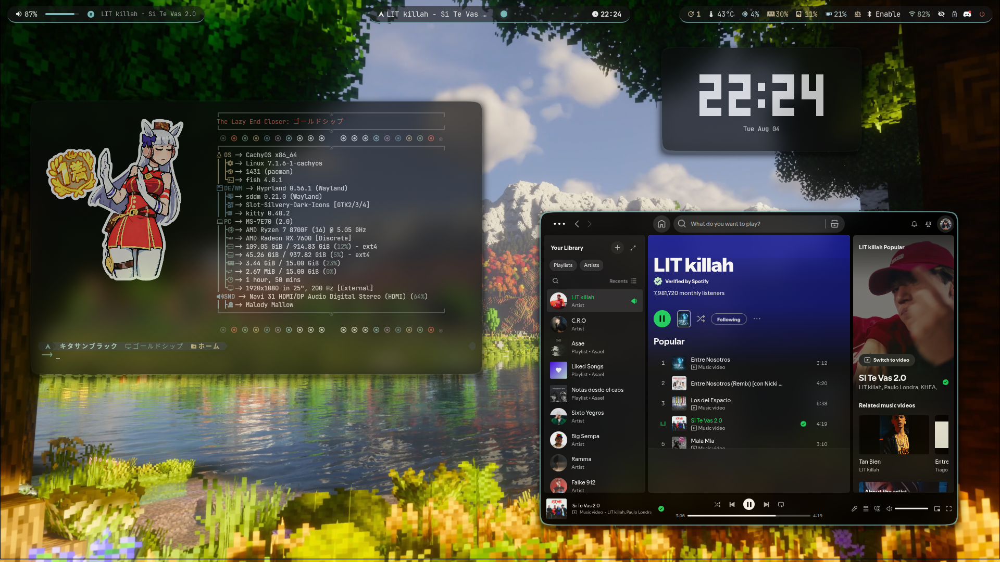
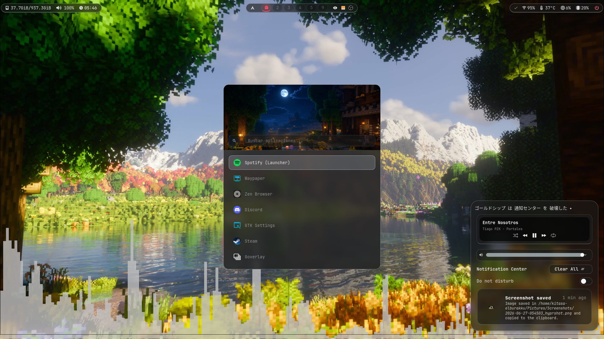
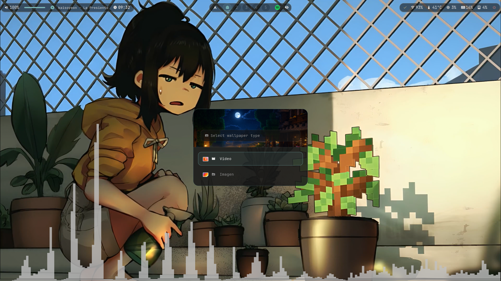
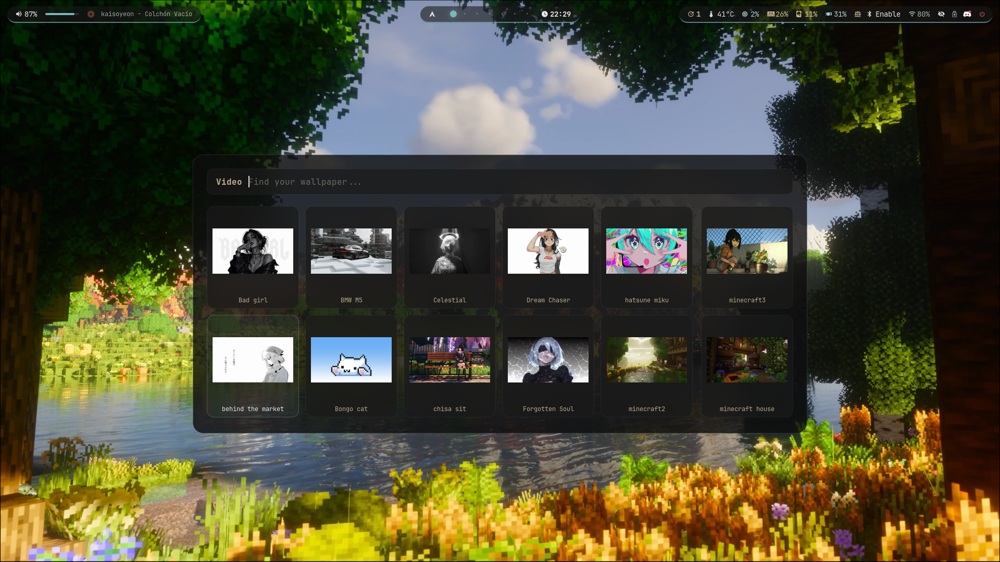
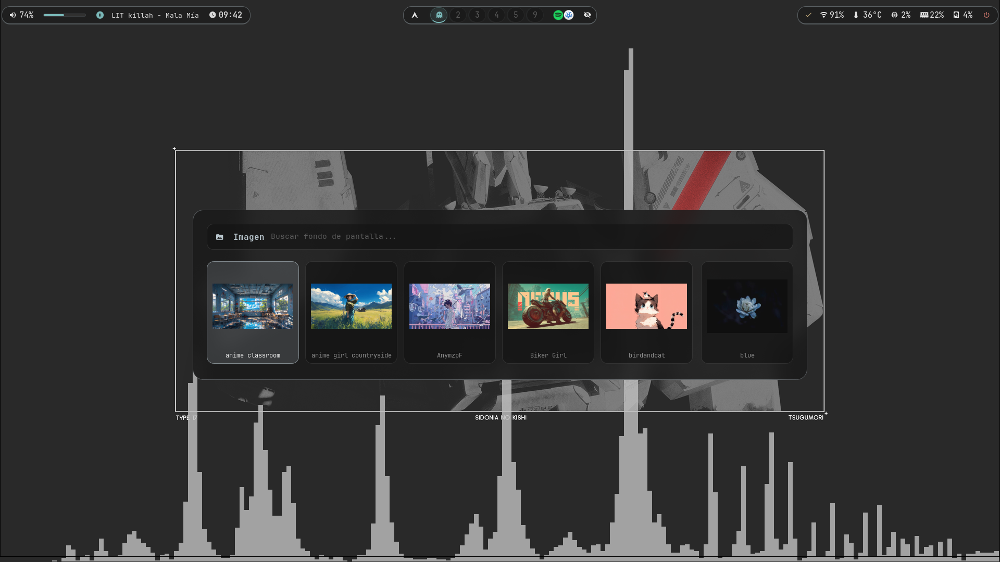
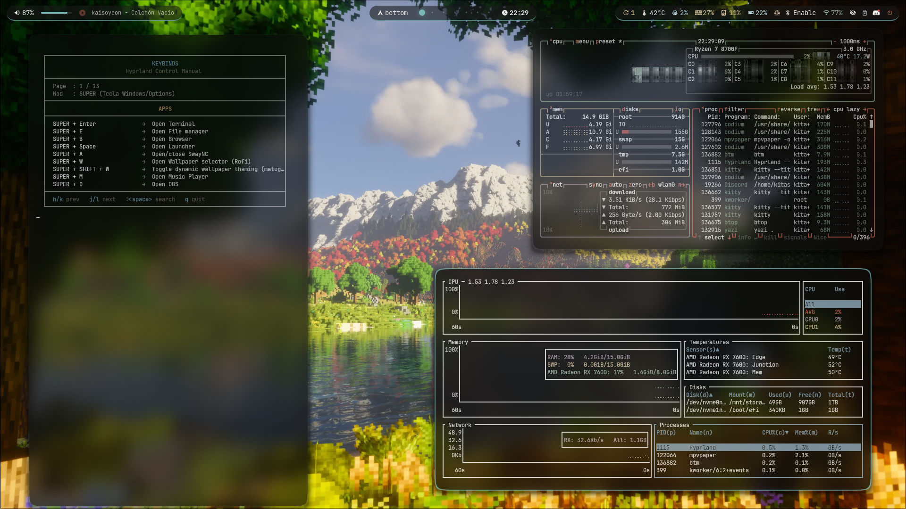
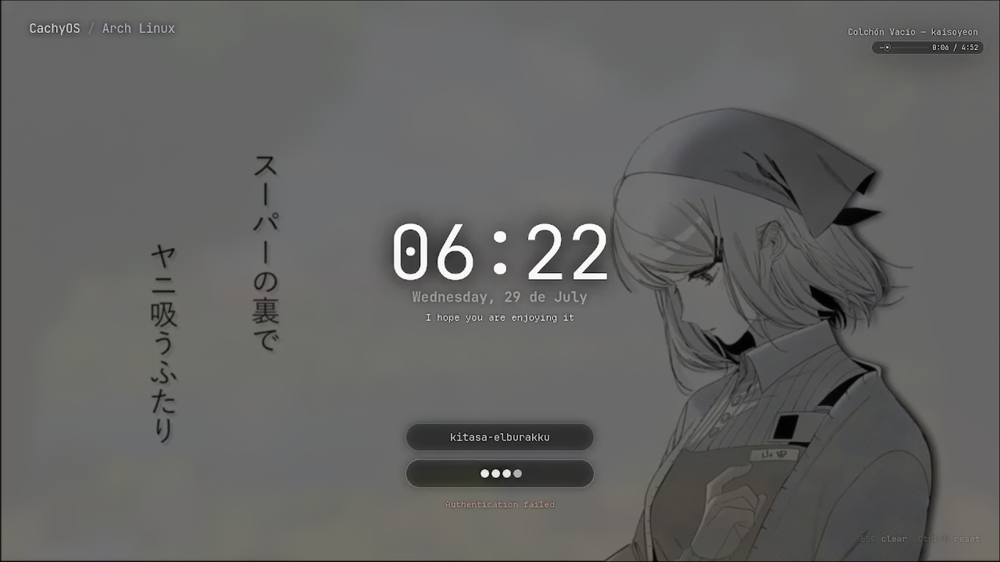

# Minecraft-Rice-Hyprland

My personal Hyprland configuration inspired by Minecraft, running on CachyOS.

This project is **NOT an automatic installer**, **NOT a universal configuration**, and **does NOT guarantee compatibility with all systems**.

> You can do whatever you want with this dotfile — if you don't want to install or use a configuration, you simply don't have to copy it.

> 🚫 **No theme selector, no matugen, no pywal.**
> The color palette is hardcoded and intentional. This setup has one vibe and commits to it.

---

## Screenshots

### Desktop


### Rofi + SwayNC


### Wallpaper Picker


### Video Wallpaper Picker


### Image Wallpaper Picker


### Terminal with animated background


### Hyprlock


---

## Where to start?

This repository is designed for two types of people:

**If you're coming from Windows or are new to Linux →**
Read the [Command Reference](#command-reference) section first, then [Before You Begin](#before-you-begin), and then follow the README in order.

**If you already know Linux and dotfiles →**
Go straight to [Repo Structure](#repo-structure), [Hyprland in Lua](#hyprland-in-lua), and [Things You Must Change](#things-you-must-change).

---

## Why this repository exists

I came to Linux from Windows looking for more control over my system. I started with Arch, made a lot of mistakes, learned from all of them, and eventually migrated to CachyOS where I built this rice.

Most modern configurations use automatic installers that hide how everything works under the hood. This repository takes the opposite approach.

The idea is not to copy everything and hope it works. The idea is:

```text
Read → Understand → Adapt → Learn → Build your own configuration
```

Here you'll find real paths, real scripts, and decisions made for a daily-use system. Some things will work right away, others will require modifications — and that's precisely where the learning happens.

If you're looking for a one-click install, this repository probably isn't for you.
If you want to understand what each file does before running it, then it probably is.

---

## Who is this for?

This may be useful if:

- You're coming from Windows and want to learn Linux from the inside out.
- You want to understand how a real rice is organized and built.
- You're interested in Hyprland, Wayland, and dotfiles.
- You prefer to understand what you install before running it.
- You like modifying and adapting configurations to your own system.

It's probably NOT for you if:

- You're looking for a fully automatic installer.
- You don't want to edit configuration files.
- You expect guaranteed compatibility without making changes.

---

## Hardware used

```
CPU: AMD Ryzen 7 8700F
GPU: AMD Radeon RX 7600 8GB
RAM: 16GB DDR5
Monitor: 1920x1080 @ 200Hz
OS: CachyOS
```

This configuration was developed and tested on this hardware. Some parts depend specifically on AMD.

---

## Tools used

| Tool | Function |
|---|---|
| Hyprland (Lua) | Modular window manager |
| Waybar | Status bar |
| Rofi | Launcher, clipboard selector, two-level wallpaper selector (Videos / Images, each with its own theme), and decorative power menu |
| matugen | Optional dynamic theming — the reload script is ready to use it but it's not connected to Hypr/Waybar in this rice, see [External Additions](#external-additions) |
| Kitty | Terminal |
| Fish + Starship | Shell with custom prompt — includes `starship.toml` with "Floating Stone Bubbles" theme (Minecraft shader palette) |
| Fastfetch | System info on terminal open |
| Hyprlock | Lock screen |
| SwayNC | Notification center |
| Wlogout | Session menu |
| mpvpaper | Video wallpaper (loops mp4/mkv/webm/mov) |
| awww | Static image wallpaper (replaces swww) |
| cava | Audio visualizer — includes config, custom GLSL shaders, and themes (agua, solarized_dark, tricolor) |
| glava | Alternative visualizer, optionally used in Hyprlock scripts |
| terminal-bg | Animated background inside the terminal (launches cava in noncurses mode) |
| Qylock | Minecraft-style SDDM theme |
| MINEGRUB | Minecraft-style GRUB theme |

> Qylock: https://github.com/Darkkal44/qylock
> MINEGRUB: https://github.com/Lxtharia/minegrub-theme
> terminal-bg (DaarcyDev): https://github.com/DaarcyDev/terminal-bg

---

## Features

- Hyprland configuration split into Lua modules inside `hypr/modules/`, including an animation system with curves and springs under the custom name "Velvet Motion" (`animations.lua`).
- Autostart for animated wallpaper with `mpvpaper`, Waybar, SwayNC, Hypridle, Polkit, clipboard, udiskie, and animated terminal background with cava.
- Two-level wallpaper selector as native Rofi script mode, shortcut `SUPER + SHIFT + W`. Opens a type selector (Videos / Images, each sourced from a different directory) before showing the thumbnail grid — each level uses its own `.rasi` theme. Thumbnail generation runs in the background and never blocks the menu. Optional dynamic theming via matugen is disabled by default — see [Rofi — Wallpaper Selector](#rofi--wallpaper-selector).
- Waybar with modules for disk, audio, clock, workspaces, tray, updates (with direct access to `sysupdate`), network, temperature, CPU, memory, and a power button connected to a mini Rofi menu.
- Rofi as application launcher, clipboard history selector, and decorative power menu (the different font in that menu is intentional, to make it stand out; the actual session is handled by Wlogout).
- Kitty with Fish as shell, custom color theme "Kitasan-Ship Minecraft Edition" (palette of Creeper greens, stone grays, redstone reds), and Fastfetch image support via Kitty's graphics protocol.
- Fish with Starship, "Minecraft Overworld" palette applied to shell syntax, random rotation between 9 Fastfetch presets, modern aliases, and custom maintenance/diagnostic functions plus an interactive keybind viewer — see [Fish Functions](#fish-functions).
- cava with custom config (pipewire, noncurses, 60fps), three swappable themes (`agua`, `solarized_dark`, `tricolor`) and six custom GLSL shaders for visual mode.
- Hyprlock with minimalist layout (clock, date, user, password) and several additional scripts in the repo that are not connected to the current layout (battery, MPRIS, weather, location — available if you want to build your own info-heavy version).
- SwayNC with notification center, quick controls, and `goldship` theme.
- Wlogout with lock, logout, suspend, shutdown, hibernate, and reboot actions — this is the system's real session menu.
- Hot-swappable Hyprland layout (dwindle / master / scrolling), with `scrolling` as the default.
- 3-finger horizontal swipe gesture to switch workspaces, configured in `hypr/modules/input.lua`.
- Shortcuts for screenshots, color picker, multimedia control, floating with auto-resize, Waybar reload, and system tools.
- The fuck: typo corrector integrated into Fish.

---

## Repo Structure

```text
.
├── cava/               # Config, GLSL shaders and themes for the audio visualizer
├── docs/screenshots/   # Rice screenshots
├── fastfetch/          # jsonc configs, logos and visual presets
├── fish/               # config.fish, functions, aliases and Fish shell themes
├── hypr/               # Hyprland Lua, modules, hypridle.conf and base hyprlock.conf
├── hyprlock/           # Lock screen layout, colors, wallpaper and scripts
├── kitty/              # Kitty configuration and colors
├── rofi/               # Launcher, clipboard, two-level wallpaper selector (wallpaper_launcher.sh → wallpaper_rofi.sh → wallpaper_grid.sh), and power menu
├── scripts/            # Personal scripts (terminal-bg-cava.sh)
├── starship.toml       # Starship config (prompt), goes in ~/.config/starship.toml
├── swaync/             # Notification center config, styles, icons and theme
├── waybar/             # Waybar config, CSS and scripts
└── wlogout/            # Layout, CSS, icons and shutdown/session scripts
```

Each folder goes inside `~/.config/` on your system, except `docs/` and `starship.toml` (which goes directly at `~/.config/starship.toml`).

---

## Dependencies

Package names may vary depending on your enabled repositories. Check each package before installing it.

### Recommended base for Arch / CachyOS

```bash
sudo pacman -Syu
sudo pacman -S \
  hyprland waybar kitty fish starship fastfetch rofi-wayland \
  hyprlock hypridle swaync wlogout \
  pipewire wireplumber pavucontrol playerctl \
  networkmanager network-manager-applet \
  bluez bluez-utils blueman \
  wl-clipboard cliphist grim slurp swappy \
  thunar btop udiskie polkit-kde-agent \
  jq curl imagemagick libnotify ffmpeg \
  pacman-contrib reflector fzf bat eza zoxide ripgrep \
  lm_sensors ttf-jetbrains-mono-nerd\
  thefuck
```

> If you use CachyOS you can download Zen-Browser from pacman packages:
```bash
sudo pacman -S zen-browser-bin
```

### AUR or to verify

```bash
yay -S \
  mpvpaper \
  hyprshot \
  hyprpicker \
  nwg-look \
  vscodium-bin \
  cava \
  glava \
  awww \
  matugen
```

> If you don't use CachyOS you can download Zen-Browser from AUR packages:
```bash
yay -S zen-browser-bin
```

## IMPORTANT: IF YOU INSTALL THINGS FROM THE AUR, CAREFULLY REVIEW WHAT WILL BE INSTALLED.

`awww` is the image wallpaper backend used by this rice. `swww` is **not used** — `awww` replaced it entirely. Install `awww` from the AUR.

**Marked as to verify:**

- `hyprland-lua`: this rice uses `hypr/hyprland.lua` with `hl.*` calls, not classic `hyprland.conf`. Verify the correct package or method for your version of Hyprland.
- `hyprshutdown`: appears as an optional fallback in a keybind.
- `glava`: optionally used in Hyprlock scripts if Spotify is playing.
- `Future-black-cursors`, `Colloid-cursors`, SDDM Minecraft, Minegrub: install or replace according to your system.
- `obs`, `brave`, `vscodium`: personal applications tied to keybinds, not requirements of the base environment.
- `awww`: required by the Rofi wallpaper selector to apply static images. `swww` is not used in this rice — `awww` replaced it. `matugen` is only needed if you build the theme selector described in [External Additions](#external-additions).

---

## Before You Begin

> ⚠️ Make a backup of your current configuration before copying any files.

```bash
mkdir -p ~/backup-configs

cp -r \
  ~/.config/hypr \
  ~/.config/waybar \
  ~/.config/kitty \
  ~/.config/fish \
  ~/.config/rofi \
  ~/.config/fastfetch \
  ~/.config/hyprlock \
  ~/.config/swaync \
  ~/.config/wlogout \
  ~/.config/scripts \
  ~/backup-configs 2>/dev/null
```

If something goes wrong you'll be able to restore your previous configuration easily.

> ⚠️ Read the files before copying them.

> ⚠️ Don't run scripts you don't understand.

> ⚠️ Check personal paths, wallpapers, sensors, and programs before logging into Hyprland.

---

## Manual Installation

This repo is not plug-and-play.

```bash
git clone https://github.com/kitasael-burakku/Minecraft-Rice-Hyprland.git ~/dotfiles
cd ~/dotfiles
```

Copy the folders you want to use:

```bash
mkdir -p ~/.config
cp -r hypr waybar rofi kitty fish fastfetch hyprlock swaync wlogout scripts cava ~/.config/
cp starship.toml ~/.config/starship.toml

mkdir -p ~/Documents
cp ~/dotfiles/KEYBINDS.txt ~/Documents/KEYBINDS.txt
```

### Wallpapers

Video wallpapers are **not included** in this repo due to file size limits. Place your own video wallpapers here:

```bash
mkdir -p ~/Videos/wallpapersvideo
# Place your .mp4 .mkv .mov .webm files here
```

For static image wallpapers, the ones used in this rice come from [NischalDawadi/Wallpapers](https://github.com/NischalDawadi/Wallpapers). Full credit to the original author.

```bash
mkdir -p ~/Pictures
git clone https://github.com/NischalDawadi/Wallpapers.git ~/Pictures/Wallpapers
```

> The wallpaper picker expects videos in `~/Videos/wallpapersvideo/` and images in `~/Pictures/Wallpapers/`. Both paths can be overridden by exporting `WALLPAPER_DIR_VIDEO` and `WALLPAPER_DIR_IMG` before launching the picker.

---

Give execution permissions to the scripts:

```bash
chmod +x ~/.config/waybar/scripts/*.sh
chmod +x ~/.config/rofi/launcher.sh
chmod +x ~/.config/swaync/scripts/*.sh
chmod +x ~/.config/wlogout/scripts/*.sh
chmod +x ~/.config/hyprlock/scripts/*.sh
chmod +x ~/.config/scripts/terminal-bg-cava.sh
chmod +x ~/.config/rofi/scripts/*.sh
```

If you want to use Fish as your default shell:

```bash
chsh -s /usr/bin/fish
```

Before logging into Hyprland, check paths, monitors, sensors, wallpaper, and programs. If something doesn't exist on your system, Hyprland may start incomplete or some shortcuts won't do anything.

---

## Hyprland in Lua

The main configuration is at:

```text
hypr/hyprland.lua
```

That file loads modules:

```lua
require("modules.animations")
require("modules.autostart")
require("modules.decoration")
require("modules.environment")
require("modules.input")
require("modules.programs")
require("modules.keybinds")
require("modules.layout")
require("modules.misc")
require("modules.monitors")
require("modules.windowrules")
```

> This is **not the classic `hyprland.conf` format**. You need Lua support for Hyprland to be working in your installation. If your Hyprland only reads `hyprland.conf`, this configuration will not load as-is.

Key files:

- `hypr/modules/programs.lua` — terminal, file manager and launcher (global `Programs` table used by `keybinds.lua`).
- `hypr/modules/keybinds.lua` — keyboard shortcuts, screenshots, multimedia and session.
- `hypr/modules/autostart.lua` — services and programs that launch with Hyprland.
- `hypr/modules/monitors.lua` — automatic output detection, resolution, position, and scale.
- `hypr/modules/input.lua` — keyboard layout, sensitivity, 3-finger horizontal swipe to switch workspace, and per-device config placeholder.
- `hypr/modules/environment.lua` — Wayland, Qt, Electron, and AMD environment variables.
- `hypr/modules/decoration.lua` — gaps, borders, rounding, opacity, shadow and blur. Colors are hardcoded (not read from matugen).
- `hypr/modules/layout.lua` — configuration for the three layouts (dwindle, master, scrolling); the active default is `scrolling`. Can be hot-swapped with `SUPER + SHIFT + D/M/O`.
- `hypr/modules/animations.lua` — custom curves and springs system ("Velvet Motion") for windows, fades, layers, workspaces, and zoom.
- `hypr/modules/windowrules.lua` — window and layer rules (blur/alpha/animation for SwayNC, Rofi, Wlogout, Waybar).
- `hypr/modules/misc.lua` — miscellaneous settings, includes disabling Hyprland's random wallpaper/logo.

---

## Rofi — Wallpaper Selector

The wallpaper selector is a two-level Rofi picker built entirely as native Rofi script mode, without depending on any external project. It's tied to `SUPER + SHIFT + W` and orchestrated by a wrapper script that chains two independent Rofi instances:

```
SUPER + SHIFT + W
      ↓
wallpaper_launcher.sh               ← entry point (called from keybind)
      ↓
rofi (wallpaper-type-select.rasi)   ← level 0: choose type
  │   󰎁  Video
  │   󰉏  Imagen
      ↓ (selection written to /tmp/rofi-wallpaper-next)
rofi (wallpaper-picker.rasi)        ← level 1: thumbnail grid
  │   [thumb] [thumb] [thumb] ...
      ↓
applies wallpaper + matugen_reload
```

**Scripts involved:**

- `rofi/scripts/wallpaper_launcher.sh` — entry point called by the keybind. Runs the type selector, waits for it to close, reads the chosen directory from `/tmp/rofi-wallpaper-next`, then opens the grid picker with the correct theme. This sequential approach (blocking Rofi instances) is what makes the two-level flow reliable.
- `rofi/scripts/wallpaper_rofi.sh` — runs as the script mode modi for the type selector. On selection, writes the target directory and prompt label to `/tmp/rofi-wallpaper-next` and exits cleanly.
- `rofi/scripts/wallpaper_grid.sh` — runs as the script mode modi for the thumbnail grid. Lists wallpapers from the chosen directory with their thumbnails as icons. On selection, applies the wallpaper and calls `matugen_reload.sh`.
- `rofi/scripts/generate-thumbs.sh` — generates `.jpg` thumbnails for both `WALLPAPER_DIR_VIDEO` and `WALLPAPER_DIR_IMG` into `~/.cache/rofi-wallpapers/thumbs`. Runs in the background when the picker opens — never blocks the menu.
- `rofi/scripts/matugen_reload.sh` — called after applying a wallpaper. Can reload matugen, Hypr, Waybar, Kitty, Cava, SwayNC, and SwayOSD. **All `ENABLE_*` flags are off by default** — see [External Additions](#external-additions).

**Directories:**

| Variable | Default | Contents |
|---|---|---|
| `WALLPAPER_DIR_VIDEO` | `~/Videos/wallpapersvideo` | Videos (`mp4`, `mkv`, `mov`, `webm`) and images |
| `WALLPAPER_DIR_IMG` | `~/Pictures/Wallpapers` | Static images only (`jpg`, `png`, `webp`, `gif`) |

Both can be overridden by exporting the variable before the launcher runs.

**Applying wallpapers:**
- Video formats → relaunches `mpvpaper` with `--loop-file --hwdec=auto`
- Image formats → `awww img` with transition

**Themes:**
- Type selector uses `rofi/wallpaper-type-select.rasi` (compact list, inherits Ship Gray style from `style-4.rasi`)
- Grid picker uses `rofi/wallpaper-picker.rasi` (4-column thumbnail grid)

The keybind in `hypr/modules/programs.lua` calls `wallpaper_launcher.sh` directly, not `wallpaper_rofi.sh`. If you point the keybind at the wrong script, only the type selector opens and nothing happens after you choose.

---

## Cava — Audio Visualizer

The `cava/` folder includes three components:

- **`config`** — configures cava with pipewire method, noncurses output at 60fps in mono mode (averaged). This is the config used by `scripts/terminal-bg-cava.sh` for the animated terminal background.
- **`themes/`** — three color palettes: `agua` (blues), `solarized_dark`, and `tricolor`. To activate a theme, copy its contents into the `[color]` block of `cava/config`.
- **`shaders/`** — six GLSL shaders for cava's visual mode: `bar_spectrum.frag`, `eye_of_phi.frag`, `northern_lights.frag`, `spectrogram.frag`, `winamp_line_style_spectrum.frag`, and `pass_through.vert`. To use them, enable the `ngl` method in the `[output]` section of `cava/config` and point `shader` to the path of the `.frag` you want.

> Shaders require cava to be compiled with OpenGL support (`ngl`). Check your package before enabling them.

---

## External Additions

I'm fairly purist about this: I change wallpapers often (based on mood or time of day), but I don't change my color palette every time I do. That's why `rofi/scripts/matugen_reload.sh` ships with all its `ENABLE_*` variables (`ENABLE_DYNAMIC_COLORS`, `ENABLE_MATUGEN`, `ENABLE_HYPR_RELOAD`, `ENABLE_WAYBAR_RELOAD`, `ENABLE_KITTY_RELOAD`, `ENABLE_CAVA_RELOAD`, `ENABLE_SWAYNC_RELOAD`, `ENABLE_SWAYOSD_RELOAD`) turned off by default.

The script already knows when to run `matugen` and which processes to notify after applying a wallpaper, but the "apply those colors" part isn't wired up in this repo: `hypr/modules/decoration.lua` has colors hardcoded, `waybar/style.css` doesn't import any external color file, and `kitty.conf` uses my own static theme. I didn't build it end-to-end, so I don't document it as if it works.

If you want a real theme selector with this, you'd need to:

1. Have your own matugen templates pointing to the paths in `HYPR_COLORS_PATH` / `WAYBAR_COLORS_PATH` (or export those variables to wherever they should write).
2. Make `decoration.lua`, `waybar/style.css`, and `kitty.conf` read those generated files instead of the fixed values they have now.
3. Enable only the `ENABLE_*` variables that correspond to what you actually wire up.

If you end up building it, this is a good place to document how you set it up.

---

## Fish Functions

Beyond aliases and external tool integrations, Fish includes custom functions invocable as commands:

- `sysupdate` — updates pacman and AUR (yay) in one pass, with animated output. This is the same thing that runs when you click the `custom/updates` module in Waybar.
- `quickcache` — quick cleanup of known app caches (browser, Spotify, Electron, etc.) — browser detection is automatic, only cleans what's actually installed, with confirmation before deleting.
- `checktrash` / `cleantrash` — the first only reports what can be cleaned (orphan packages, caches, trash); the second actually cleans it, with confirmation.
- `checkerrors` — diagnoses failed services, journalctl errors (including Hyprland/portals), and recent coredumps. Read-only, changes nothing.
- `healthcheck` — quick overview of the entire system in one screen: kernel, memory/zram, pending updates, orphan packages, `.pacnew`/`.pacsave` files, failed services, boot errors, disk, network, and temperatures. Unlike `checkerrors`, it does not show full logs — it only counts and flags what needs attention.
- `keybinds` — opens an interactive viewer for `KEYBINDS.txt` directly in the terminal, with vim-style navigation (`h/j/k/l`), search (`:` + space), and section pagination. While open, it automatically floats and centers the terminal window.
- `fastfetch` (the function, not the binary) — randomly picks one of the presets in `fastfetch/config*.jsonc`, avoiding repeating the same one twice in a row.

> ⚠️ `keybinds` depends on `KEYBINDS.txt` maintaining an exact format: section header in UPPERCASE, a line of only dashes below it, and entries as `KEY    Description` with at least two spaces between columns. If you edit that file manually, respect the format or the viewer will stop recognizing sections.

---

## Things You Must Change

At minimum, review before using:

- `hypr/hyprlock.conf` — change `$hyprlockDir` to your real path (`/home/your-username/.config/hyprlock`).
- `hypr/modules/autostart.lua` — change the animated wallpaper path `~/Videos/wallpapersvideo/minecraft3.mp4` to yours.
- `hypr/modules/environment.lua` and `hypr/modules/autostart.lua` — both define the same cursor theme; if you change it, update it in both files to avoid them going out of sync.
- `hypr/modules/input.lua` — the entry `hl.device({ name = "epic-mouse-v1" })` is a placeholder example; change it to the real name of your mouse if you want per-device sensitivity, or remove it.
- `hypr/modules/programs.lua` — change `kitty`, `thunar`, or the launcher if you use other apps.
- `hypr/modules/keybinds.lua` — change `obs`, `vscodium`, `zen-browser`, screenshot paths, and commands you don't use.
- `waybar/config.jsonc` — change `hwmon-path = /sys/class/hwmon/hwmon3/temp1_input` to the correct sensor for your machine. The `hyprland/window` module displays the fixed text `"CachyOs"` on purpose (aesthetic decision); change it to `{title}` if you prefer to see the real focused window title.
- `hyprlock/layouts/layout.conf` — change `~/.config/hyprlock/wallpapers/1.png` if you use a different wallpaper.
- `wlogout/style.css` — the six icon paths (`lock.png`, `logout.png`, `hibernate.png`, `shutdown.png`, `reboot.png`, `suspend.png`) are written as absolute paths to my user; change them to yours.
- `fastfetch/config*.jsonc` — change logos, images and presets if you don't want to use the included assets.
- `swaync/config.json` — change buttons like `blueman-manager`, `nwg-look`, or `nm-connection-editor` if you don't use them.

> `hypr/modules/monitors.lua` uses automatic detection (`output = ""`, `mode = "preferred"`, `position = "auto"`, `scale = "auto"`), so it shouldn't need changes in most cases. If you have multiple monitors or a specific configuration, adjust it there.

To find all personal paths at once:

```bash
rg "/home/|your-username|kitasa-elburakku|wallpaper|hwmon|Future-black|Colloid" .
```

---

## Scripts and Commands Used in This Rice

- **Hyprland/Wayland:** `hyprctl`, `hyprlock`, `hypridle`, `waybar`, `swaync`, `swaync-client`, `wlogout`, `awww`, `matugen`
- **Audio/media:** `wpctl`, `pavucontrol`, `playerctl`, `cava`, `glava`
- **Screenshots/clipboard:** `hyprshot`, `grim`, `slurp`, `swappy`, `wl-copy`, `wl-paste`, `cliphist`, `hyprpicker`
- **System:** `systemctl`, `loginctl`, `pacman`, `yay`, `checkupdates`, `paccache`, `journalctl`, `lm_sensors`
- **Network/GUI:** `nm-connection-editor`, `blueman-manager`, `nwg-look`
- **Terminal/shell:** `kitty`, `fish`, `starship`, `fastfetch`, `fzf`, `bat`, `eza`, `zoxide`, `ripgrep`
- **Utilities:** `curl`, `jq`, `imagemagick`/`magick`, `ffmpeg`, `libnotify`/`notify-send`, `udiskie`, `reflector`

---

## Notes for Beginners

- Don't blindly copy everything. Start with one folder, test it, then move on to the next.
- If a command fails, run it manually in the terminal to see the actual error.
- Paths with `/home/your-username/...` are examples. Replace them with your actual username or use `$HOME` when the program supports it.
- Icons depend on Nerd Fonts. If you see squares or strange symbols, install and select a Nerd Font in your terminal.
- Waybar may break the temperature module if your hardware sensor is different from mine.
- Fish functions run real tasks like updating packages and cleaning caches. Read them before using them.
- Hyprlock scripts use MPRIS, `playerctl`, `curl`, `jq`, `imagemagick`, and external services like `wttr.in` or `ipinfo.io`.
- The `hyprlock/` folder includes scripts for battery, MPRIS/Spotify, weather, location, and stopwatch that **are not connected** to the active `layout.conf` — they were left available in case you want to build your own info-heavy layout; the current lock screen is deliberately minimalist.
- Some settings are tailored specifically to my hardware, my programs, and my workflow.

---

## Command Reference

> This section is for people coming from Windows or just starting out with Linux. If you already know these, feel free to skip it.

### git clone

```bash
git clone https://github.com/user/repository.git
```

Downloads a repository from GitHub to your computer, preserving the change history. It's equivalent to downloading a ZIP but better.

---

### cd

```bash
cd ~/dotfiles
```

Changes the current directory (folder) in the terminal. `cd ~/.config` enters the configuration folder.

---

### mkdir

```bash
mkdir -p ~/.config
```

Creates directories. The `-p` flag avoids errors if the folder already exists.

---

### cp and cp -r

```bash
cp file.txt destination/        # copies a file
cp -r hypr waybar ~/.config/    # copies entire folders (recursive)
```

Without `-r`, Linux won't copy directories.

---

### chmod +x

```bash
chmod +x script.sh
```

Adds execution permissions. Required to run `.sh` scripts as programs.

---

### chsh

```bash
chsh -s /usr/bin/fish
```

Changes the user's default shell. After logging out and back in, Fish will open automatically instead of Bash.

---

### rg (ripgrep)

```bash
rg "wallpaper" .
```

Searches for text inside files. Very useful for finding personal paths, usernames, sensors, and variables in configs.

---

### sudo

```bash
sudo pacman -S package
```

Runs a command with administrator permissions. Only use it when you understand what the command does.

---

### pacman

```bash
sudo pacman -S package      # install
sudo pacman -Rns package    # remove with unneeded dependencies
sudo pacman -Syu            # update the entire system
```

Package manager for Arch Linux and CachyOS.

---

### yay

```bash
yay -S package
```

Installs packages from the AUR (Arch User Repository). Works similar to pacman but accesses community-maintained software.

---

### Why is there no automatic installer?

Copying files manually lets you understand where each configuration lives, which program uses each file, detect errors more easily, and modify specific parts without depending on automatic scripts.

Manual installation requires more work, but teaches you much more about how the system actually works.

---

## External Credits

- Hyprland, Waybar, Rofi, Kitty, Fish, Starship, Fastfetch, Hyprlock, Hypridle, Wlogout, and SwayNC belong to their respective projects.
- The Rofi wallpaper selector (`rofi/scripts/wallpaper_launcher.sh` + `wallpaper_rofi.sh` + `wallpaper_grid.sh`) is original work: a two-level picker built as native Rofi script mode, chaining two independent Rofi instances with state passed via `/tmp/rofi-wallpaper-next`. Replaces the previous Quickshell-based version.
- [matugen](https://github.com/InioX/matugen) is the dynamic theming tool that the wallpaper selector's reload script is prepared to use, but it's not connected in this rice — see [External Additions](#external-additions).
- Some presets in `fastfetch/config*.jsonc` are adapted from the official Fastfetch project examples.
- terminal-bg was created by [DaarcyDev](https://www.youtube.com/@DaarcyDev).
- Minecraft is property of Mojang/Microsoft. The aesthetic used here is fan-made/personal.
- SDDM Minecraft, Minegrub, cursors, wallpapers, icons, logos, and character images are external assets unless otherwise noted.
- Nerd Fonts and JetBrains Mono Nerd Font belong to their respective authors.

If you reuse this rice, keep the credits for the projects and assets you use.

---

## Project Status

Personal rice in progress. May contain paths, decisions, and dependencies very specific to my system. Use it as learning material and as a base to build your own configuration.

---

## Project Philosophy

My goal is not to build a perfect configuration, but one that I can understand, maintain, and modify without depending on external tools or unnecessary layers of abstraction.

I prefer:

- Modular configuration over giant files.
- Manual installation over magic scripts.
- Understanding over copying.
- Simplicity over unnecessary complexity.
- Learning over automating.

If this repository helps you learn something about Linux, Hyprland, Waybar, Fish, or dotfiles, then it has already fulfilled its purpose.