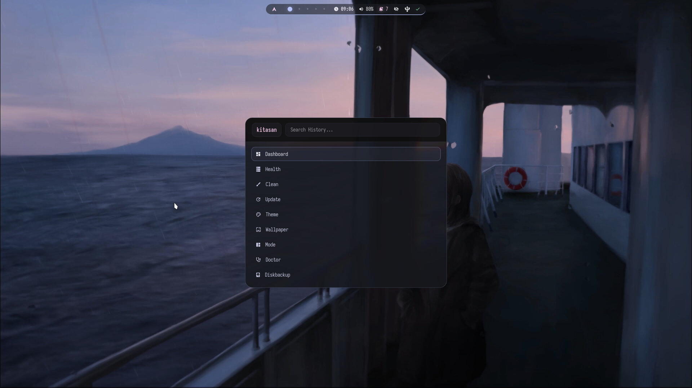
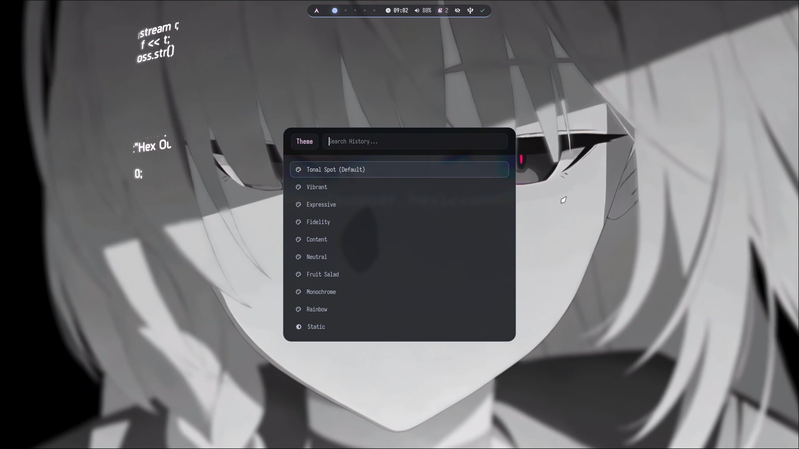
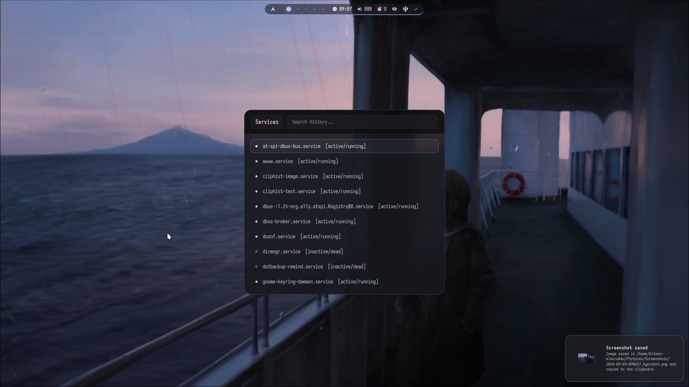
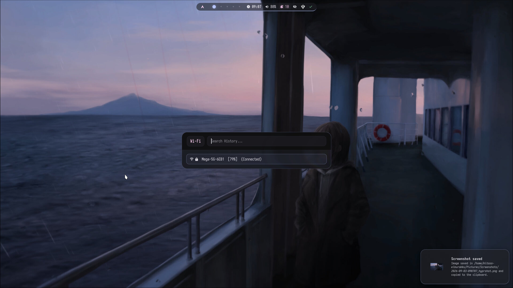
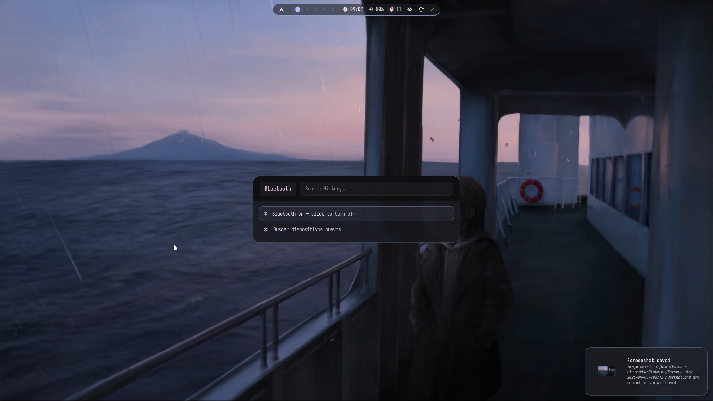

# Gallery

Every screenshot in this repository, grouped by what it shows, with the keybind that produces it and the doc that explains it.

All of them were taken on the author's machine at 1920x1080 and live in [`screenshots/`](screenshots/). The wallpapers visible in them are **not** part of the repository — image wallpapers are the only ones that could ship, and video wallpapers are gitignored outright ([Repository Tour](../README.md#repository-tour)). What you get on a fresh clone is the layout, not the pictures behind it.

The palette in most of these shots is the static **"Kitasan Glass"** teal that ships hardcoded. Dynamic theming (matugen) is off by default; see [THEMING.md](THEMING.md).

> Quick index — [Desktop](#desktop) · [Launcher and menus](#launcher-and-menus) · [Wallpapers](#wallpapers) · [Theming](#theming) · [System and status](#system-and-status) · [Lock screen](#lock-screen)

---

## Desktop

**Desktop** — the resting state: Waybar collapsed to its centre island at the top, Fastfetch in Kitty on the left, the MPRIS player on the right, and a clock widget. The two side islands of the bar are hidden until the cursor enters their third of the top 60 px band.
`SUPER + Enter` opens the terminal · `SUPER + M` toggles the player
→ [ARCHITECTURE.md § Waybar cursor zones](ARCHITECTURE.md)

---

## Launcher and menus

<table>
<tr>
<td width="50%">

 <b>App launcher + SwayNC</b> — the Rofi <code>drun</code> launcher with its mode switcher along the bottom, next to the SwayNC notification centre with the media widget, volume slider and Do Not Disturb toggle. <code>SUPER + Space</code> · <code>SUPER + A</code> → <a href="ARCHITECTURE.md">ARCHITECTURE.md § Rofi tooling</a>
</td>
<td width="50%">

 <b><code>kitasan</code> menu</b> — the Rofi front-end to the <code>kitasan</code> CLI: Dashboard, Health, Clean, Update, Theme, Wallpaper, Mode, Doctor and Diskbackup, each one calling the same Fish function you would from a shell. <code>SUPER + F4</code> · <code>fish -c 'kitasan menu'</code> → <a href="ARCHITECTURE.md">ARCHITECTURE.md § kitasan CLI</a>
</td>
</tr>
<tr>
<td width="50%">

 <b>Window switcher</b> — a Rofi mode that lists live Hyprland windows with their real app icons and lets you type to filter. It talks to Hyprland through <code>hyprctl eval</code> rather than positional dispatches. <code>ALT + Tab</code> · <code>rofi/scripts/window-switcher.sh</code> → <a href="ARCHITECTURE.md">ARCHITECTURE.md § Rofi tooling</a>
</td>
<td width="50%">

 <b>Keybind viewer + monitors</b> — the paginated <code>KEYBINDS.txt</code> reader on the left, with <code>btop</code> and <code>bottom</code> beside it. The file is generated from <code>keybinds.lua</code>, so the viewer never drifts from the actual binds. <code>SUPER + F1</code> · <code>hypr/scripts/generate-keybinds-doc.sh</code> → <a href="../KEYBINDS.txt">KEYBINDS.txt</a>
</td>
</tr>
</table>

---

## Wallpapers

The picker is two levels deep: first the type, then a thumbnail grid for that type. Both grids are generated ahead of time by `rofi/scripts/generate-thumbs.sh` and refreshed by a systemd timer, which is why they open instantly no matter how large the folder is.

**Wallpaper picker — level 1** — the type selector: kill the running video wallpaper, or pick from videos or images.
`SUPER + W` · `rofi/scripts/wallpaper_launcher.sh`

<table>
<tr>
<td width="50%">

 <b>Level 2 — images</b> — the thumbnail grid for static wallpapers. Picking one hands it to <code>apply-wallpaper.sh</code>, which sets it through <b>awww</b> (not swww), records it in <code>hypr/.current-wallpaper</code> and regenerates the Hyprlock background. <code>hypr/scripts/apply-wallpaper.sh</code>
</td>
<td width="50%">

 <b>Level 2 — video</b> — the same grid for animated wallpapers, whose thumbnails are single frames pulled with <code>ffmpegthumbnailer</code>. These play through mpvpaper; the video files themselves are gitignored. <code>hypr/scripts/apply-wallpaper.sh</code>
</td>
</tr>
</table>

→ [ARCHITECTURE.md § Wallpaper system](ARCHITECTURE.md)

---

## Theming

**Theme picker** — the nine matugen schemes (Tonal Spot, Vibrant, Expressive, Fidelity, Content, Neutral, Fruit Salad, Monochrome, Rainbow) plus **Static**, which drops back to the hardcoded "Kitasan Glass" palette. Choosing one writes `matugen/scheme` and re-derives every colour file from the current wallpaper — Hyprland borders, Waybar, Rofi, SwayNC, Kitty, GTK3/4 and Qt5/6 all at once.
`SUPER + ALT + W` · `rofi/scripts/theme.sh` — and `SUPER + SHIFT + W` toggles the whole pipeline on or off
→ [THEMING.md](THEMING.md)

---

## System and status

<table>
<tr>
<td width="50%">

 <b>Dashboard</b> — one Rofi screen for the state of the machine: downed user services, CPU and GPU temperature, disk usage, what is playing, how long since the last <code>dotbackup</code>, and the update check. Rows are actionable — selecting <i>Run dotbackup</i> or <i>Play/Pause</i> does it. <code>SUPER + F5</code> · <code>rofi/scripts/dashboard.sh</code>
</td>
<td width="50%">

 <b>Service manager</b> — every <code>systemd --user</code> unit with its live state, and start / stop / restart / journal on the one you pick. The session is built out of 12 services and 4 timers, so this is the usual way in when something did not come up. <code>SUPER + F3</code> · <code>rofi/scripts/systemd.sh</code> → <a href="ARCHITECTURE.md">ARCHITECTURE.md § Session lifecycle</a>
</td>
</tr>
<tr>
<td width="50%">

 <b>Wi-Fi</b> — nearby networks with signal strength and connection state, over <code>nmcli</code>. Selecting a secured network prompts for the password in the same Rofi window. <code>SUPER + F6</code> · <code>rofi/scripts/wifi.sh</code>
</td>
<td width="50%">

 <b>Bluetooth</b> — power toggle plus a scan entry that lists discoverable devices and pairs or connects them, over <code>bluetoothctl</code>. <code>SUPER + F7</code> · <code>rofi/scripts/bluetooth.sh</code>
</td>
</tr>
</table>

---

## Lock screen

**Hyprlock** — distro label top-left, the currently playing track with its progress bar top-right, clock and date centred, and the password field at the bottom. The background is `hyprlock/wallpapers/current.png`, regenerated by `apply-wallpaper.sh` every time the wallpaper changes, so the lock screen always matches the desktop. Hypridle triggers it on idle; `SUPER + ALT + H` triggers it by hand.
→ [ARCHITECTURE.md](ARCHITECTURE.md)

---

## Taking your own

Screenshots go to `~/Pictures/Screenshots/` and land on the clipboard at the same time:

| Bind | Captures |
|---|---|
| `SUPER + F12` | The whole monitor |
| `SUPER + F11` | A region, then opens it in Swappy for annotation |
| `SUPER + F10` | The focused window only |

If you are replacing the images in this folder for a fork, keep the filenames — both `README.md` and this page reference them by name, and nothing rewrites those references for you.
